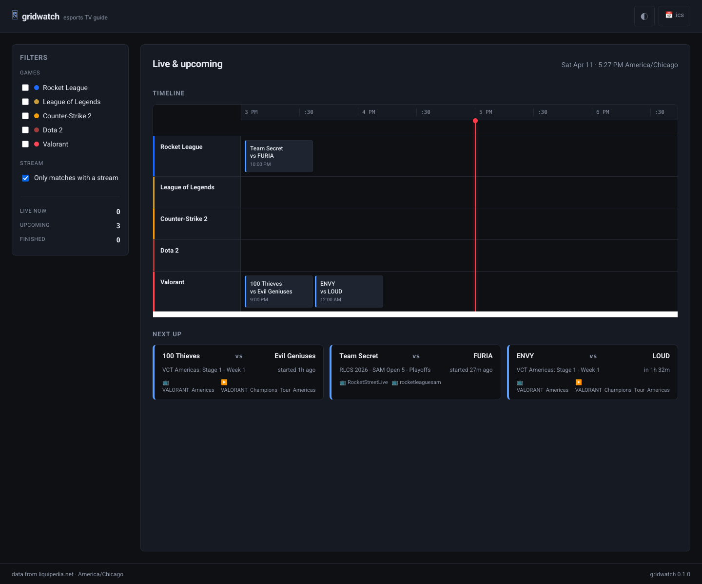
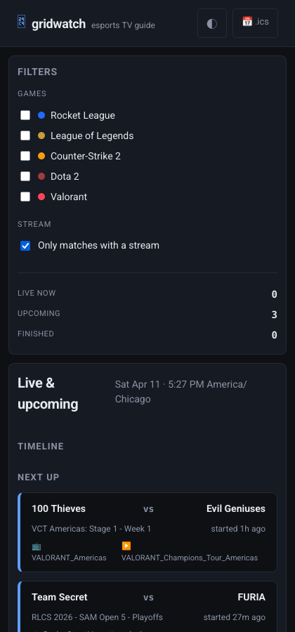

<a id="readme-top"></a>

[![Contributors][contributors-shield]][contributors-url]
[![Forks][forks-shield]][forks-url]
[![Stargazers][stars-shield]][stars-url]
[![Issues][issues-shield]][issues-url]
[![MIT License][license-shield]][license-url]
[](https://github.com/jacob-sabella/gridwatch/actions/workflows/ci.yml)

# Gridwatch

Self-hosted multi-game esports TV guide. One browser tab shows every live, upcoming, and recently-finished match across Rocket League, League of Legends, CS2, Dota 2, Valorant, and more — with direct click-through to the stream.

Cross-platform: **Linux**, **macOS**, and **Windows**. Ships as a single static Go binary (~14 MB) or a distroless Docker image (<15 MB). No database. No build tooling. Runs anywhere you can put a binary.





## Features

### Upstream data
- Polls **Liquipedia** wikis while strictly honoring their [API Terms of Use](https://liquipedia.net/api-terms-of-use) at the code level:
  - **User-Agent** in the exact format they document (`Name/version (url; contact)`)
  - **gzip** is mandatory and always sent
  - **Global rate cap** at **1 request per 60 seconds** — half their 1-per-30s ceiling for the parse API
  - **600s per-page floor** (10 min between fetches of any single wiki page)
  - **1-hour cooldown** on 429 / 5xx responses (their ToU warns about temp IP bans)
  - Shared `http.Client` with connection pooling (no new connection per request)
  - Anonymous requests so their caches can do their job
- **Refuses to start** if config tries to exceed the ToU ceiling — it's a hard gate, not a best-effort warning
- Refuses to start without a `contact` config field
- Golden-file parser tests against captured Liquipedia HTML per game — if their templates drift, CI fails loudly
- In-memory store with 48h eviction and optional JSON snapshot for cold-start warmth

### EPG timeline (desktop)
- Horizontal scrollable grid with a time axis and one row per game/tournament
- Live matches pinned in a pulsing "Live Now" banner above the grid
- 30-minute slot granularity, configurable window (-2h to +24h by default)
- Live "now" cursor line, per-game accent colors
- Filters for game, region, tier, and "has stream" — filter state mirrored to URL query string for shareable links

### Mobile card view
- Auto-switches at `max-width: 720px` via pure CSS container queries
- Three sections: **Live Now**, **Upcoming**, **Recent Results**
- Thumb-reach stream button per card
- Dark / light / auto theme (follows `prefers-color-scheme`)

### Real-time updates
- Server-sent events at `/events` emit revision bumps on store writes
- Client triggers an htmx refresh in place — no full page reload
- Fallback to 60s polling if the browser doesn't support EventSource
- Reverse-proxy-friendly (sends `X-Accel-Buffering: no` for nginx)

### APIs
- **JSON** at `/api/v1/matches` — same filter params as the UI, for Homepage / Home Assistant widgets
- **iCal** at `/api/v1/matches.ics` — subscribe in Google Calendar, Fantastical, or iCal
- **XMLTV** at `/api/v1/matches.xml` — Plex Live TV, Jellyfin Live TV, xTeVe, TVHeadend, and Kodi can ingest this as a native program guide
- **Prometheus metrics** at `/metrics` (opt-in)
- `/healthz` with a freshness SLA — returns 503 if no successful poll in `2 × poll.liquipedia_interval`

### Notifier (optional)
- Push live/result alerts to **ntfy** or a generic **webhook**
- Rules engine with game, stage, region, and minimum-tier filters
- Dedupe state marked **only on 2xx delivery** — failed deliveries retry on the next cycle (a common footgun in similar tools)
- Uses ntfy's JSON publish format so emoji in titles just works (no header-encoding bugs)

### Supported games

| slug              | game                | default Bo | default duration |
|-------------------|---------------------|:----------:|:----------------:|
| `rocketleague`    | Rocket League       | 5          | 90 min           |
| `leagueoflegends` | League of Legends   | 5          | 60 min           |
| `counterstrike`   | Counter-Strike 2    | 3          | 90 min           |
| `dota2`           | Dota 2              | 3          | 75 min           |
| `valorant`        | Valorant            | 3          | 90 min           |
| `starcraft2`      | StarCraft II        | 5          | 60 min           |
| `overwatch`       | Overwatch           | 5          | 45 min           |

Any other Liquipedia wiki slug also works — gridwatch will generate reasonable defaults for unknown games. Every field is overridable in the config.

## Install

Pull the Docker image or download a pre-built release. The binary is fully static — no libc, no tzdata, nothing to install alongside it.

### From Docker (recommended)

```bash
docker run -p 8080:8080 \
  -e GRIDWATCH_CONTACT=you@example.com \
  ghcr.io/jacob-sabella/gridwatch:latest
```

Open http://localhost:8080 — you're done. The baked-in default config tracks Rocket League, League of Legends, and Counter-Strike 2.

> `GRIDWATCH_CONTACT` is **required** because Liquipedia's API Terms of Use require a contact in the User-Agent string. Gridwatch refuses to start without it.

### From docker compose

A ready-to-use compose file lives at `deploy/docker-compose.yml`:

```bash
cd deploy
GRIDWATCH_CONTACT=you@example.com docker compose up -d
```

### From a release archive

Grab the archive for your platform from the [Releases page](https://github.com/jacob-sabella/gridwatch/releases), extract, and run:

```bash
./gridwatch --config gridwatch.yaml
```

## Usage

### Minimum viable config

The whole thing fits in two keys:

```yaml
contact: "you@example.com"
games:
  - rocketleague
  - leagueoflegends
  - counterstrike
```

The full schema lives in [`configs/gridwatch.example.yaml`](configs/gridwatch.example.yaml) with every knob documented inline.

### Plex / Jellyfin Live TV

Gridwatch can't play Twitch streams itself, but its **XMLTV feed** lets Plex Live TV or Jellyfin Live TV (via xTeVe or TVHeadend) render the schedule as a native program guide. Point your tuner middleware at `http://gridwatch.lan:8080/api/v1/matches.xml` as an XMLTV source. Clicking through to the actual stream still happens in the browser.

## Build from Source

Requires Go 1.23+.

```bash
# Development build
go build ./cmd/gridwatch

# Run full test suite with race detector
go test -race ./...

# Run against the example config (hits Liquipedia for real)
make run

# Run with canned fixtures, no upstream calls (for screenshots)
make demo

# Build a local Docker image
make docker
```

Parser golden files regenerate with:

```bash
go test ./internal/source/liquipedia/ -run TestParseRocketLeagueGolden -update
```

Add a new game by dropping its `Liquipedia:Matches` parse API response into `internal/source/liquipedia/testdata/<slug>_matches.json` and adding a corresponding test.

## Architecture

```
Poller goroutines       Sources                 Store
┌──────────────┐       ┌──────────────┐        ┌──────────────┐
│ per-game     │──────>│ Liquipedia   │───────>│ in-memory    │
│ jittered     │       │ (HTML parse) │ merge  │ revision-    │
│ schedule     │       └──────────────┘        │ tracked      │
└──────┬───────┘                ^              └──────┬───────┘
       │                        │                     │
       v                        │                     v
┌──────────────┐       ┌──────────────┐        ┌──────────────┐
│ Rate limiter │       │ httpx client │        │ HTTP/SSE     │
│ per-host +   │       │ gzip + UA    │        │ server       │
│ global cap   │       │ enforced     │        │ embed.FS UI  │
└──────────────┘       └──────────────┘        └──────┬───────┘
                                                      │
                                         ┌────────────┼────────────┐
                                         v            v            v
                                    ┌─────────┐  ┌────────┐  ┌─────────┐
                                    │  JSON   │  │  iCal  │  │  XMLTV  │
                                    │  /api   │  │  feed  │  │  feed   │
                                    └─────────┘  └────────┘  └─────────┘
```

- **Poller**: one goroutine per (source, game), jittered so N games don't fire simultaneously
- **Rate limiter**: two-layer token bucket — per-wiki-page floor (default 600s) + global RPS envelope (default 1/60s, hard-capped at the ToU ceiling of 1/30s via config validation)
- **Store**: `sync.RWMutex`-guarded map, revision counter for SSE clients, merge semantics that preserve `FirstSeenAt` and dedupe state across polls
- **Notifier**: consumes store transitions, runs the rule engine, delivers to sinks in parallel, marks fired only on 2xx
- **UI**: stdlib `html/template` + htmx + ~200 lines of hand-written CSS, served from `embed.FS`. No build step.

Everything in one process. No database. One binary.

## Dependencies

| Package           | Purpose                                                  |
|-------------------|----------------------------------------------------------|
| `golang.org/x/time` | Rate limiter for upstream polling                      |
| `gopkg.in/yaml.v3`  | Config loader                                          |
| `htmx` (vendored) | Frontend interactivity without a framework               |

That's the entire dependency tree. The rest is stdlib.

## Vibe Coded

This entire project was vibe coded with [Claude Code](https://claude.ai/claude-code). Architecture, implementation, UI design, parser engine, notifier rules, Dockerfile, CI pipeline — all of it. No hand-written code.

## License

Distributed under the MIT License. See [LICENSE](LICENSE).

[contributors-shield]: https://img.shields.io/github/contributors/jacob-sabella/gridwatch.svg?style=for-the-badge
[contributors-url]: https://github.com/jacob-sabella/gridwatch/graphs/contributors
[forks-shield]: https://img.shields.io/github/forks/jacob-sabella/gridwatch.svg?style=for-the-badge
[forks-url]: https://github.com/jacob-sabella/gridwatch/network/members
[stars-shield]: https://img.shields.io/github/stars/jacob-sabella/gridwatch.svg?style=for-the-badge
[stars-url]: https://github.com/jacob-sabella/gridwatch/stargazers
[issues-shield]: https://img.shields.io/github/issues/jacob-sabella/gridwatch.svg?style=for-the-badge
[issues-url]: https://github.com/jacob-sabella/gridwatch/issues
[license-shield]: https://img.shields.io/github/license/jacob-sabella/gridwatch.svg?style=for-the-badge
[license-url]: https://github.com/jacob-sabella/gridwatch/blob/main/LICENSE
